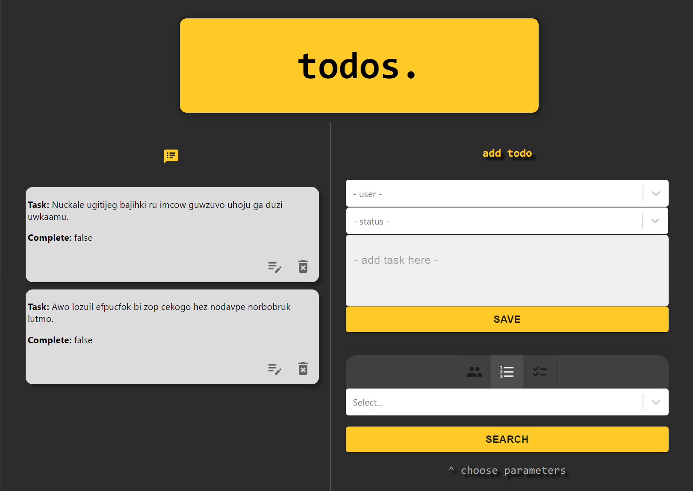

  
  # Type-Todo
  
  ## Table of Contents
  * [Description](#description)
  * [Technologies](#technologies)
  * [Installation](#installation)
  * [Usage](#usage)
  * [Contributing](#contributing)
  * [Guidelines](#guidelines)
  * [Tests](#tests)
  * [License](#license)
  * [Questions](#questions)
---

  ## Description
  Simple React todo app with full CRUD operations, creating using create-react-app and utilizing typescript and context for global state. Following best practices and project structure. User is first presented with fake data generated with the @chance npm, with the ability to edit, update and delete extisting entries + create new tasks. User can filter results by specific criteria - by task, by user, and by isComplete status. 
  
  

  ## Technologies
  * React
  * Typescript
  * TSX
  * Node
 
  
  ## Installation
   No installation requirements

  ## Usage
   Visit https://mleftwich.github.io/type-todo

  ## Contributing
   If you'd like to contribute, reach out through the email below

  ## Guidelines
   None

  ## Tests
   Tests run in development

  ## License
   Licensed under [MIT](https://opensource.org/licenses/MIT) 

   ---

  ## Questions
   For any questions you can find me at [GitHub](https://github.com/mleftwich) or email me at [mleftwich@live.com](mailto:mleftwich@live.com) 